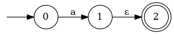

In this project you will implement algorithms to work with NFAs, DFAs, and regular expressions. In particular, you will implement `accept` to see whether a string is matched by a NFA; `nfa_to_dfa` to convert an NFA to a DFA using te subset construction; `regex_to_nfa` to convert a regular expression to an NFA. You will also implement several other helper functions to assist in these tasks.

## Part 1: NFAs

This first part of the project asks you to implement some functions for working with NFAs. In particular, you will be asked to implement the *move* and *epsilon closure* functions [described in class][lecture notes]; these will be handy for Part 2. You will also implement an `accept` function to determine whether a string is matched by a given NFA; both *move* and *epsilon closure* may be handy here, too.

### NFA Types
The type `nfa_t` is the type representing NFAs. It is modeled after the formal definition of an NFA, a 5-tuple (Σ, Q, q0, F, δ) where:

1. Σ is a finite alphabet,
2. Q is a finite set of states,
3. q0 ∈ Q is the start state,
4. F ⊆ Q is the set of accept states, and
5. δ : Q × (Σ ∪ {ε}) → 𝒫(Q) is the transition function (𝒫(Q) represents the powerset of Q).

Notice the types are parametric in state `'q` and symbol `'s`.

The type `transition` represents NFA transitions. For example:

```ocaml
let t1 = (0, Some 'c', 1)  (* Transition from state 0 to state 1 on character 'c' *)
let t2 = (1, None, 0)      (* Transition from state 1 to state 0 on epsilon *)
```

While the formal definition of a transition is a function which maps a state and character to a set of states, we will define transitions as 3-tuples so that each edge in the NFA will correspond to a single transition in the list of transitions. This will make the syntax for defining NFAs cleaner, and allows for a one-to-one mapping between elements of the transition list and edges in the NFA graph.

An example NFA would be:

```ocaml
let nfa_ex = {
    sigma = ['a'];
    qs = [0; 1; 2];
    q0 = 0;
    fs = [2];
    delta = [(0, Some 'a', 1); (1, None, 2)]
}
```

This looks like:



Here is a DFA:

```ocaml
let dfa_ex = {
    sigma = ['a'; 'b'; 'c'];
    qs = [0; 1; 2];
    q0 = 0;
    fs = [2];
    delta = [(0, Some 'a', 1); (1, Some 'b', 0); (1, Some 'c', 2)]
}
```

#### `accept nfa s`

## Part 2: DFAs

In this part, our goal is to implement the `nfa_to_dfa` function. It uses the subset construction to convert an NFA to a DFA. 

Every DFA is also an NFA, but the reverse is not true. The subset construction converts an NFA to a DFA by grouping together multiple NFA states into a single DFA state. Hence, our DFA type is `('q list, 's) nfa_t`. Our states are now sets of states from the NFA. The description will use "dfa state" to mean a set of states from corresponding NFA.

### `new_states nfa qs`

- **Type**: `('q, 's) nfa_t -> 'q list -> 'q list list`
- **Description**: Given an NFA and a DFA state computes all the DFA states that you can get to from a transition out of `qs` (including the dead state). Dead states are represented by empty lists. *Note: each element in the set corresponds to all of the states you can get to from one character of the alphabet (`sigma`) followed by any number of epsilon transitions*``

### `new_trans nfa qs`

- **Type**: `('q, 's) nfa_t -> 'q list -> ('q list, 's) transition list`
- **Description**: Given an NFA and a DFA state, computes all the transitions coming from `qs` (including the dead state) in the DFA.

### `new_finals nfa qs`

- **Type**: `('q, 's) nfa_t -> 'q list -> 'q list list`
- **Description**: Given an NFA and a DFA state, returns `[qs]` if `qs` is final in the DFA and `[]` otherwise.
  ```

### `nfa_to_dfa nfa`

- **Type**: `('q, 's) nfa_t -> ('q list, 's) nfa_t`
- **Description**: This function takes as input an NFA and converts it to an equivalent DFA. The language recognized by an NFA is invariant under `nfa_to_dfa`. In other words, for all NFAs `nfa` and for all strings `s`, `accept nfa s = accept (nfa_to_dfa nfa) s`.


#### `nfa_to_dfa_step nfa dfa wrk`

- **Type**: `('q, 's) nfa_t -> ('q list, 's) nfa_t -> 'q list list -> ('q list, 's) nfa_t`
- **Description**: First, let's take a look at what is being passed into the function for clarity:

  *Parameters*
  - `nfa`: the NFA to be converted into a DFA.
  - `dfa`: the DFA to be created from the NFA. This will act as the accumulator in the function. Each time this function is called, the DFA should be updated based on the worklist.
  - `wrk`: a list of unvisited states.

  Given an NFA, a partial DFA, and a worklist, this function will compute one step of the subset construction algorithm. This means that we take an unvisited DFA state from the worklist and add it to our DFA that we are creating (updating the list of all states, transitions, and final states appropriately). Our worklist is then updated for the next iteration by removing the newly processed state. 
  

## Part 3: Regular Expressions

For the last part of the project, you will implement code to convert a regular expression to an NFA. (Then you could use your `NFA` module developed above to match particular strings.) The `Regexp` module represents a regular expression with the type `regexp_t`:

```ocaml
type regexp_t =
  | Empty_String
  | Char of char
  | Union of regexp * regexp
  | Concat of regexp * regexp
  | Star of regexp
```
